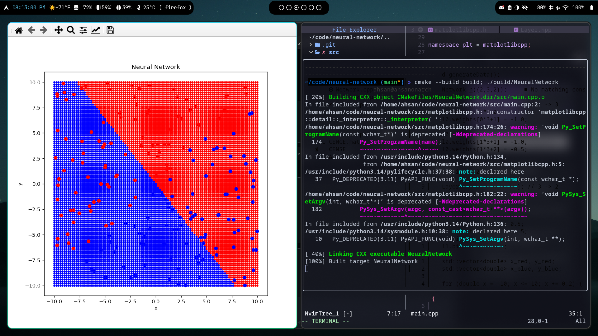

# neural-network
Neural Network made from scratch in pure C++ using Matplotlib-C++ for rendering only.

## Build Instructions
Create a folder named `build`, and run `cmake ..`, followed by whatever build system you use (likely `make`).
Ensure that Python3, Numpy, and Matplotlib are installed.
