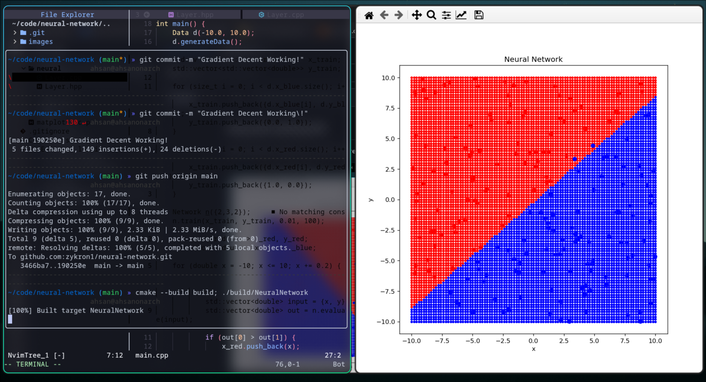

# neural-network
Neural Network made from scratch in pure C++ using Matplotlib-C++ for rendering only.



Before training:


## Build Instructions
Ensure that CMake, C++, Python3, Numpy, and Matplotlib are installed.

```
mkdir build
cmake --build build
./build/NeuralNetwork
```
